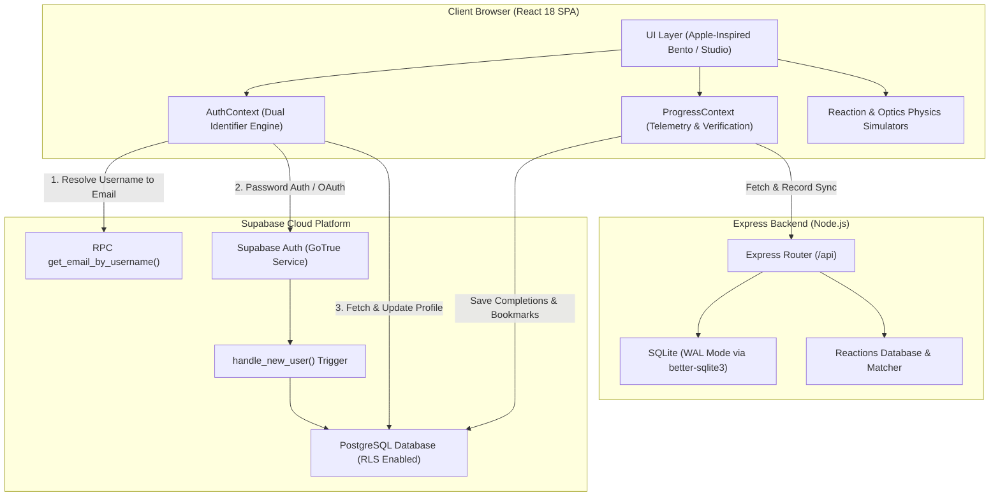
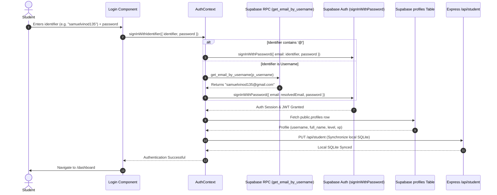

# 📐 LabXplore — System Architecture Document

This document describes the technical architecture, component interactions, authentication lifecycle, scientific simulation mathematics, and data flows of the **LabXplore** platform.

---

## 1. System Overview & Topology

LabXplore employs a hybrid distributed architecture balancing cloud scalability (Supabase) with local edge persistence and compute (Node/Express API + SQLite WAL):

---

## 2. Technology Stack

| Layer | Technology | Rationale |
| :--- | :--- | :--- |
| **Frontend Framework** | React 18.3 + Vite 6 | Lightning-fast HMR, component tree virtualization, and lean production bundles |
| **Routing** | React Router v6 | Declarative layout nesting, client-side route transitions, and guard management |
| **Styling & Design** | Tailwind CSS 3.4 + Handcrafted CSS | Custom design tokens (`.btn-yellow-primary`, `.card-sky-glass`, `.slider-sky-yellow`) with hardware-accelerated CSS transforms |
| **Iconography** | Lucide React | Precision 24px/16px vector glyphs matching Apple SF Symbols aesthetics |
| **Authentication** | Supabase Auth (GoTrue) | JWT token rotation, secure cookie session storage, and Google OAuth 2.0 |
| **Cloud Database** | Supabase PostgreSQL 15 | Row-Level Security (RLS), ACID transactions, custom plpgsql triggers, and RPC procedures |
| **Backend API** | Node.js + Express 4.21 | Minimal, high-throughput microservices for physics catalogs, matching, and telemetry |
| **Local Persistence** | better-sqlite3 | Synchronous, zero-latency SQLite driver running in WAL (Write-Ahead Logging) mode |

---

## 3. Authentication & Identity Flow

One of the platform's core architectural innovations is the **Dual-Identifier Resolution Engine**, enabling students to sign in using either their registered **Email** or their human-friendly **Username**:

### Key Security Guardrails
- `get_email_by_username` executes with `SECURITY DEFINER` privileges, strictly returning a single email string and exposing zero passwords or extraneous metadata.
- Row-Level Security (RLS) policies enforce that write operations on `profiles`, `lab_completions`, and `saved_experiments` can only be performed by the authenticated owner (`auth.uid() = user_id`).

---

## 4. Scientific Simulation Physics Engines

### A. Chemical Kinetics & Arrhenius Reaction Rate
The interactive reaction chamber dynamically models reactant collisions and thermal excitation. The effective rate constant $k$ is calculated according to the Arrhenius relationship:

$$k(T) = A \cdot \exp\left(-\frac{E_a}{R \cdot T}\right)$$

In client-side evaluation:
$$\text{Rate} = [\text{Concentration}] \cdot \exp\left(\frac{T - 300\text{ K}}{400}\right)$$

Thermodynamic enthalpy ($\Delta H$) determines exothermic temperature flares and visual luminescence:
- **Magnesium Combustion**: $2\text{Mg} + \text{O}_2 \to 2\text{MgO}$ ($\Delta H = -462\text{ kJ/mol}$, brilliant white emission).
- **Acid-Metal Single Replacement**: $\text{Mg} + 2\text{HCl} \to \text{MgCl}_2 + \text{H}_2\uparrow$ ($\Delta H = -112\text{ kJ/mol}$, effervescent hydrogen bubbling).

### B. Kinematic Harmonics Differential Equation
The physics pendulum models classical gravitational restoring torque:

$$\frac{d^2\theta}{dt^2} + \frac{b}{m}\frac{d\theta}{dt} + \frac{g}{L}\sin(\theta) = 0$$

Under the small-angle approximation ($\sin\theta \approx \theta$):
$$\theta(t) = \theta_0 \cdot \cos(\omega t) \cdot e^{-\gamma t}, \quad \text{where } \omega = \sqrt{\frac{g}{L}}$$

The client animates this in real time via `requestAnimationFrame` with zero frame-dropping, computing coordinates for the bob at:
$$x(t) = L \cdot \sin(\theta(t)), \quad y(t) = L \cdot \cos(\theta(t))$$

### C. Geometric & Wave Optics (Snell's Law)
The ray tracer solves boundary refraction across planar and curved interfaces:

$$n_1 \sin(\theta_1) = n_2 \sin(\theta_2) \implies \theta_2 = \arcsin\left(\frac{n_1}{n_2}\sin(\theta_1)\right)$$

When $\frac{n_1}{n_2}\sin(\theta_1) > 1$, the simulation dynamically switches to **Total Internal Reflection (TIR)**.

---

## 5. Mobile-First Responsiveness Architecture

To guarantee effortless touch usability on mobile phones and tablets, the UI implements a three-tier responsive design constraint:

1. **Touch Ergonomics**: All interactive elements (buttons, segmented controls, modal triggers) enforce `min-height: 44px` and `min-width: 44px` conforming to Apple Human Interface Guidelines.
2. **Viewport Stability**: All `<input>` and `<select>` controls specify `font-size: 16px` on mobile viewports (`text-base sm:text-xs`) to prevent iOS Safari auto-zooming.
3. **Tactile Sliders**: Slider thumbs are customized with a `26px` diameter, 3px white border, and deep amber drop shadow (`box-shadow: 0 4px 12px rgba(217, 119, 6, 0.45)`) for fluid finger dragging.
4. **Adaptive Bento Grid**: Grid layouts smoothly transition from a 1-column stack on smartphones (`<640px`) to a 2-column layout on tablets (`640px–1024px`) and a multi-column bento workspace on desktop displays (`>1024px`).
