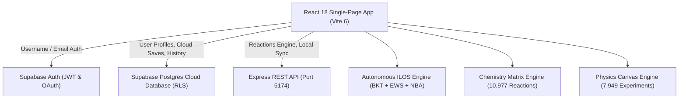

# 🧪 LabXplore — Next-Generation Virtual Science Laboratory

<div align="center">
  <p><strong>Tactile 3D Physical Computing · Virtual Chemistry & Physics Laboratory · Live Student Telemetry</strong></p>
  <p>
    
    
    
    
    
    
  </p>
</div>

---

## 🌟 Overview

**LabXplore** is a high-fidelity, interactive science education platform designed to make physical science tangible, intuitive, and engaging. Inspired by precision Apple design principles and tactile physical instruments, LabXplore allows students, researchers, and educators to conduct real-time chemical reactions, explore classical kinematic harmonics, calibrate wave and ray optics, and track verified academic milestones.

### Key Highlights
- **Exhaustive Virtual Chemistry Studio**: Over **10,977 chemically validated reactions** covering CBSE/NCERT Classes 10, 11, and 12, featuring an 18-component apparatus bench, flame temperature kinetics, gas effervescence, pH indicator titrations, and 31 named reactions with complete electron-pushing mechanisms.
- **Strict Zero-Fabrication Guard**: Enforces mathematical and chemical truthfulness—arbitrary chemical combinations are strictly validated against the verified database to eliminate AI/software hallucinations.
- **Linear Algebraic Equation Balancer**: Utilizes Gaussian elimination on elemental conservation matrices to compute integer coefficients with step-by-step audit tables.
- **High-Precision 60 FPS Physics Canvas**: Over **7,949 experiments** spanning mechanics, projectile motion, optics, electromagnetism, and wave dynamics with zero-lag canvas rendering and real-time vector projections.
- **Autonomous Institutional Learning Operating System (ILOS)**: Real-time telemetry-driven cognitive engine powered by **Bayesian Knowledge Tracing (BKT) with asymptotic damping**, Misconception Pattern Signature Detection, and ambient stealth scaffolding.
- **Strictly Role-Isolated Teacher Cockpit**: Provides cohort competency heatmaps, Early Warning Signals (EWS), and empirical Next-Best-Action (NBA) intervention plans—completely purged of student gamification mechanics.
- **Universal Device Ready**: Ultra-lightweight client bundle (<600 kB gzipped) optimized for classroom Interactive Smart Boards, budget mobile phones, and laptops.

---

## 🏗️ Architecture Summary

LabXplore utilizes a hybrid cloud and edge architecture:



For complete architectural details, refer to [ARCHITECTURE.md](file:///Users/samuel/Documents/JARVIS/ARCHITECTURE.md) and the formal [LABXPLORE_EXECUTIVE_BLUEPRINT.md](file:///Users/samuel/Documents/JARVIS/LABXPLORE_EXECUTIVE_BLUEPRINT.md).

---

## 🚀 Quick Start

### Prerequisites
- **Node.js**: v18.0.0 or higher (v20+ recommended)
- **npm**: v9.0.0 or higher

### 1. Clone the Repository
```bash
git clone https://github.com/samuelvinod135-spec/HACKTHON.git
cd HACKTHON
```

### 2. Install Dependencies
```bash
npm install
```

### 3. Configure Environment Variables
Create a `client/.env` file with your Supabase credentials:
```env
VITE_SUPABASE_URL=https://htgsiuqtlfdebxepsslh.supabase.co
VITE_SUPABASE_ANON_KEY=eyJhbGciOiJIUzI1NiIsInR5cCI6IkpXVCJ9...
```

### 4. Start Local Development
Start both the Express API backend and Vite client concurrently:
```bash
npm run dev
```

The application will be accessible at:
- **Client Web App**: [http://localhost:5173](http://localhost:5173)
- **Express API**: [http://localhost:5174](http://localhost:5174)

---

## 📦 Available Scripts

In the root directory, you can run:

| Command | Description |
| :--- | :--- |
| `npm run dev` | Launches both Vite dev server (5173) and Express API (5174) concurrently |
| `npm run dev:client` | Runs only the Vite client development server |
| `npm run dev:server` | Runs only the Express API server with automatic reload (`--watch`) |
| `npm run build` | Builds the optimized production bundle for the client |
| `npm run start` | Runs the production Express server |

---

## 🧪 Simulation Modules

### 1. Reaction Kinetics Laboratory (`/chemistry`)
- Real-time thermodynamic enthalpy calculations ($\Delta H$).
- Dynamic reaction rate computation based on Arrhenius rate law ($k = A e^{-E_a/RT}$).
- Reaction matching engine supporting acid-metal single replacement, neutralization, decomposition, and precipitation.

### 2. Kinematic Harmonics Laboratory (`/physics`)
- Simple harmonic oscillator simulation with variable pendulum length ($0.5\text{m}$ to $3.0\text{m}$).
- Multi-planetary gravity simulator (Earth $9.8\,\text{m/s}^2$, Moon $1.6\,\text{m/s}^2$, Jupiter $24.8\,\text{m/s}^2$).
- Phase trajectory plotting and dampening friction modeling.

### 3. Wave & Geometric Optics (`/physics`)
- Ray tracer implementing Snell's Law of Refraction:
  $$n_1 \sin(\theta_1) = n_2 \sin(\theta_2)$$
- Dynamic refractive index materials (Crown Glass $n=1.52$, Flint Glass $n=1.66$, Optical Diamond $n=2.42$).
- Total internal reflection and critical angle visualization.

---

## 🔐 Authentication & Student Identity

LabXplore supports flexible sign-in:
1. **Username Login**: Sign in using your custom student handle (e.g. `samuelvinod135`). An RPC lookup (`get_email_by_username`) securely resolves the email on the server before invoking Supabase Auth.
2. **Email Login**: Direct standard authentication using student email.
3. **Google OAuth**: One-click Google sign-in with consent redirect.
4. **Dynamic Avatar**: Handcrafted SVG/Initials badge (e.g. `SV`) with smooth color-hashed gradients—no generic AI placeholders or demo face avatars.

---

## 📚 Documentation Index

- [ARCHITECTURE.md](file:///Users/samuel/Documents/JARVIS/ARCHITECTURE.md) — System topology, state management, and physics algorithms.
- [DATABASE.md](file:///Users/samuel/Documents/JARVIS/DATABASE.md) — Cloud Postgres and SQLite schemas, RLS policies, and triggers.
- [API.md](file:///Users/samuel/Documents/JARVIS/API.md) — REST API specifications and request/response payloads.

---

## 🛡️ License

MIT License. Designed and engineered for high-impact STEM education.